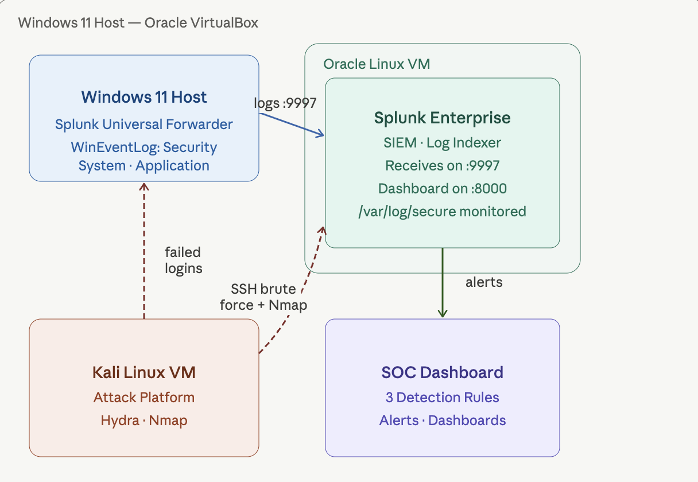
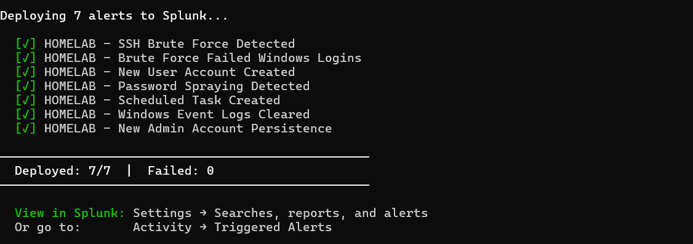
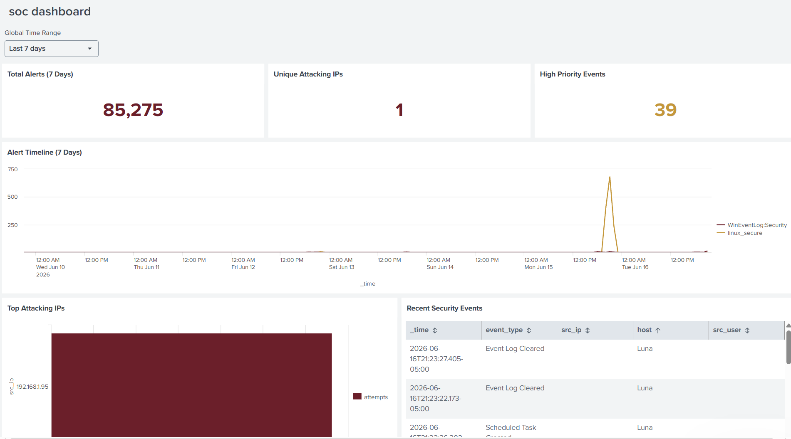
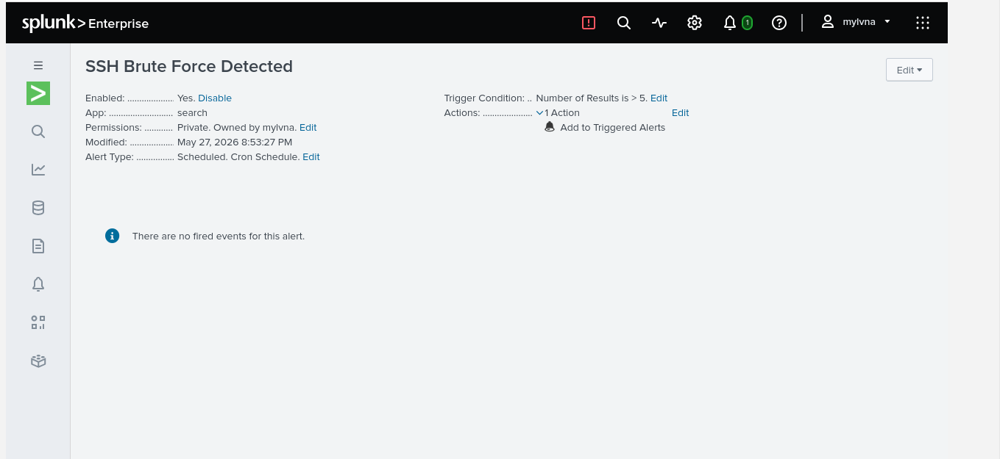
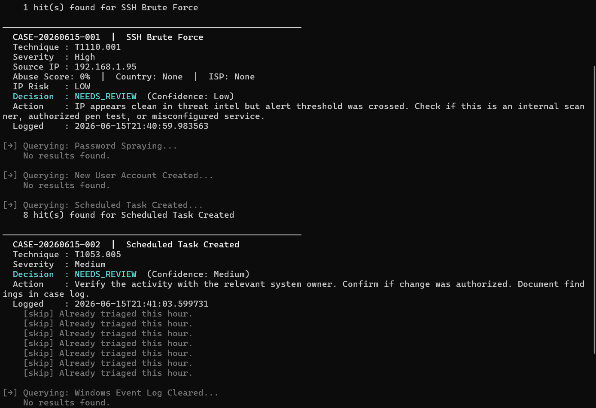
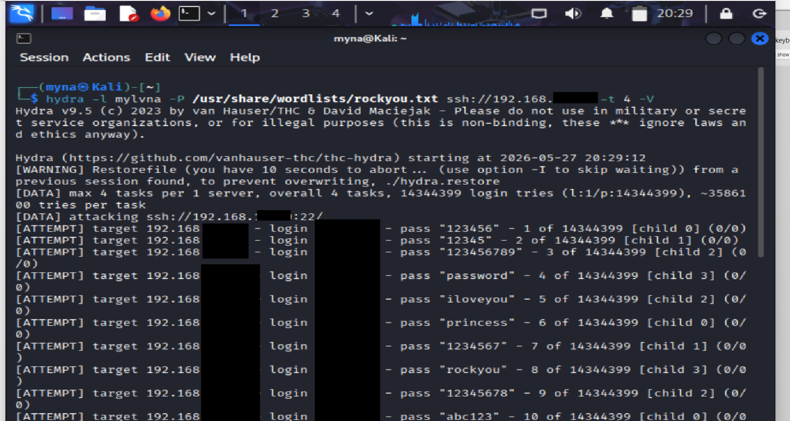
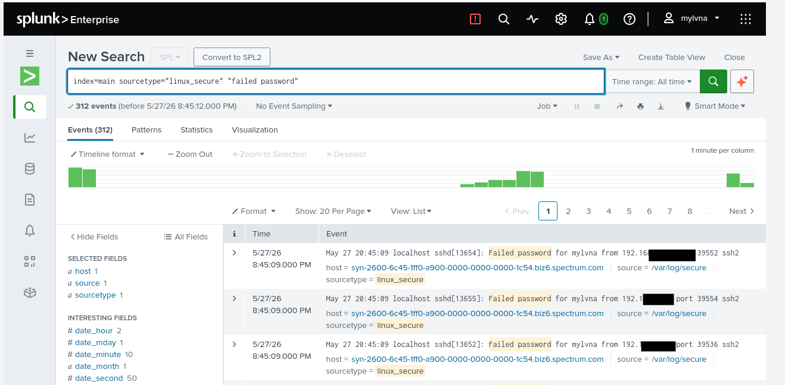
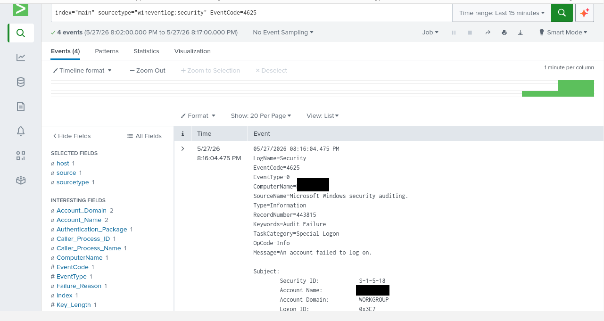
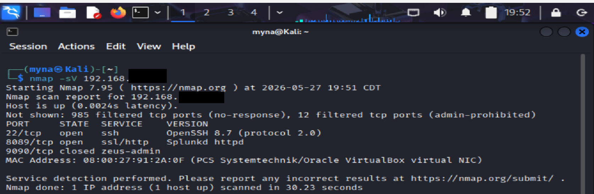

# splunk siem homelab — detection engineering & soc automation

**siem:** splunk enterprise (oracle linux vm)  
**attack platform:** kali linux vm  
**automation:** python REST API suite  
**dashboards:** splunk dashboard studio  
**status:** active — still building

---

## overview

built a fully functional soc environment from scratch across three vms. this lab simulates real enterprise soc work — ingesting live logs, detecting attacks as they happen, automating alert triage, and documenting everything through incident reports.

started with 3 basic detection rules. expanded it into a full detection engineering lab with 7 mitre att&ck-mapped rules, a python automation suite, two dashboard studio dashboards, and a soar-lite triage tool that automatically enriches and logs every alert.

---

## architecture



```
┌─────────────────┐         ┌──────────────────────────┐
│   kali linux    │ ──────▶ │     oracle linux vm       │
│   (attacker)    │         │   splunk enterprise 9.x   │
└─────────────────┘         └──────────────────────────┘
                                        ▲
                                        │ windows event logs
                             ┌──────────────────────┐
                             │     windows vm        │
                             │  security · system ·  │
                             │  application logs     │
                             └──────────────────────┘
```

---

## environment

| component | details |
| --- | --- |
| host os | windows 11 |
| virtualization | oracle virtualbox |
| siem | splunk enterprise — oracle linux vm |
| log forwarder | splunk universal forwarder — windows vm |
| attack platform | kali linux vm |
| log sources | WinEventLog:Security · WinEventLog:System · WinEventLog:Application · linux_secure |
| network | bridged adapter |

---

## mitre att&ck coverage

| id | technique | tactic | log source |
| --- | --- | --- | --- |
| T1110.001 | brute force: password guessing | credential access | linux_secure |
| T1110.001 | brute force: failed windows logins | credential access | WinEventLog:Security 4625 |
| T1110.003 | password spraying | credential access | linux_secure |
| T1136 | create account | persistence | WinEventLog:Security 4720 |
| T1078 | valid accounts: new admin | persistence | WinEventLog:Security 4720 |
| T1053.005 | scheduled task/job | persistence | WinEventLog:Security 4698 |
| T1070.001 | clear windows event logs | defense evasion | WinEventLog:Security 1102 |
| T1021.004 | remote services: ssh | lateral movement | linux_secure |
| T1046 | network service discovery | discovery | nmap scan |

---

## attacks simulated

| attack | tool | result |
| --- | --- | --- |
| network recon | nmap -sV | open ports + services identified |
| ssh brute force | hydra + rockyou.txt | 312 failed auth attempts detected |
| password spraying | hydra + username list | multi-account spray detected |
| failed windows logins | manual | event ID 4625 triggered |
| new user account | net user | event ID 4720 triggered |
| scheduled task persistence | schtasks | event ID 4698 triggered |
| event log clearing | event viewer / powershell | event ID 1102 triggered |

---

## detection rules

### rule 1 — ssh brute force (T1110.001)

```
index=main sourcetype=linux_secure "Failed password"
| stats count by host
| where count > 5
```

trigger: more than 5 failed ssh attempts from any host within 5 min

---

### rule 2 — failed windows logins (T1110.001)

```
index=main sourcetype="WinEventLog:Security" EventCode=4625
| stats count by Account_Name, host
| where count > 3
```

trigger: more than 3 failed logons per account within 5 min

---

### rule 3 — password spraying (T1110.003)

```
index=main sourcetype=linux_secure "Failed password"
| rex field=_raw "for (?:invalid user )?(?P<username>\S+) from (?P<src_ip>\S+)"
| bucket _time span=5m
| stats dc(username) as unique_users count as attempts by src_ip _time
| where unique_users > 3 AND attempts > 10
```

trigger: one source ip hitting more than 3 different usernames in 5 min  
key difference from brute force: `dc(username) > 3` — one password, many accounts

---

### rule 4 — new user account created (T1136)

```
index=main sourcetype="WinEventLog:Security" EventCode=4720
```

trigger: any new windows account creation

---

### rule 5 — new admin account persistence (T1078)

```
index=main sourcetype="WinEventLog:Security" EventCode=4720
| table _time src_user user dest
```

trigger: new account created — shows who created it and on which host

---

### rule 6 — scheduled task created (T1053.005)

```
index=main sourcetype="WinEventLog:Security" EventCode=4698
| table _time src_user TaskName TaskContent
```

trigger: any scheduled task creation — attackers use this to survive reboots

---

### rule 7 — windows event logs cleared (T1070.001)

```
index=main sourcetype="WinEventLog:Security" (EventCode=1102 OR EventCode=104)
| table _time src_user Message
```

trigger: security or system log cleared — almost zero false positives in production

**all 7 rules deployed and active in splunk:**



---

## dashboards

built two dashboard studio dashboards with inline SPL and custom burgundy color scheme.

### soc overview

| panel | type | what it shows |
| --- | --- | --- |
| total alerts (7 days) | single value | total event count across all sources |
| unique attacking IPs | single value | distinct source IPs in linux auth logs |
| high priority events | single value | critical event code count from WinEventLog:Security |
| alert timeline | area chart | hourly events split by sourcetype |
| top attacking IPs | bar chart | source IPs ranked by brute force attempt count |
| recent security events | table | last 20 events across all detection rules |



---

### mitre att&ck coverage

| panel | type | what it shows |
| --- | --- | --- |
| techniques triggered | bar chart | which att&ck technique IDs fired and how many times |
| tactic distribution | pie chart | events by tactic — credential access, persistence, defense evasion |
| detection timeline | column chart | which tactics triggered on which days over 7 days |


---

## scripts

### deploy_alerts.py — REST API alert deployment

deploys all 7 detection rules to splunk as saved searches via the REST API. what would take 45+ minutes of clicking through forms takes one command.


```bash
python3 deploy_alerts.py           # deploy all 7 alerts
python3 deploy_alerts.py --verify  # check which alerts exist in splunk
python3 deploy_alerts.py --list    # list without deploying
python3 deploy_alerts.py --delete  # remove all homelab alerts
```



---

### auto_triage.py — soar-lite alert triage

polls splunk every 60 seconds, finds triggered alerts, enriches attacker IPs with abuseipdb threat intelligence, calculates a risk score, makes a triage decision, and logs a structured case file — all automatically.

built this to understand how soar platforms actually work under the hood, not just click buttons in a $50k licensed tool.

```bash
python3 auto_triage.py              # run once against last hour of alerts
python3 auto_triage.py --watch      # poll continuously every 60s
python3 auto_triage.py --summary    # see all logged cases
```

| decision | meaning | action |
| --- | --- | --- |
| TRUE_POSITIVE | high severity + high-risk IP | block immediately |
| LIKELY_TP | high severity + medium-risk IP | review logs |
| NEEDS_REVIEW | alert fired but IP looks clean | check for false positive |
| LIKELY_FP | low confidence | monitor |



---

## challenges

stuff that didn't work the first time and what i did about it:

- **sourcetype mismatch** — windows logs came in as `WinEventLog:Security` not `WinEventLog`. ran `| stats count by sourcetype` to find the actual name then updated every rule and dashboard query to match

- **deploy_alerts.py forbidden** — API kept returning "Action forbidden" when deploying alerts. fixed by switching the owner namespace to `nobody` and changing alert severity from a string like "high" to an integer (2)

- **events not showing in dashboard** — some panels were showing 0 or no data even though the alerts were firing. turned out the dashboard was pointing to saved searches that didn't exist or had wrong names. rewrote everything as inline SPL queries so nothing depends on saved search names matching up

---

## additional screenshots


<details>
<summary>click to expand — attack simulations & raw logs</summary>

**hydra ssh brute force running from kali**



**linux auth logs with kali IP flagged in splunk**



**windows event ID 4625 — failed login detection**



**nmap recon from kali**



**auto_triage.py case log summary — structured JSON output**


</details>


## incident report

full incident report for the ssh brute force attack — covers the attack timeline, SPL queries, mitre att&ck mapping, evidence, response actions, and remediation recommendations.

→ [view incident report](Incident-Report-IR-2026-001)

---

## skills demonstrated

| area | skills |
| --- | --- |
| detection engineering | SPL query writing · mitre att&ck mapping · threshold tuning · behavioral detection · false positive reduction |
| soc operations | splunk log ingestion · windows event logs · linux auth logs · alert triage · incident response · dashboard studio |
| automation | python · splunk REST API · soar-lite orchestration · threat intel enrichment · abuseipdb · alert deployment |
| tools | splunk enterprise · kali linux · hydra · nmap · wireshark · virtualbox · windows event viewer |

---

## what i said i'd build next vs what i actually built

| goal | status |
| --- | --- |
| threat intel feeds | ✅ done — abuseipdb enrichment in auto_triage.py |
| soar playbooks | ✅ done — built soar-lite orchestrator from scratch in python |
| automated alert deployment | ✅ done — deploy_alerts.py via splunk REST API |
| expanded detection coverage | ✅ done — 3 rules → 7 rules across the att&ck kill chain |
| dashboards | ✅ done — 2 dashboard studio dashboards with inline SPL |
| disable password ssh, enforce key-based auth | ⬜ still on the roadmap |
| tune thresholds against baseline traffic | ⬜ still on the roadmap |
| expand log sources (dns, proxy, firewall) | ⬜ still on the roadmap |
| elastic/kibana + suricata | ⬜ still on the roadmap |
| aws cloudtrail ingestion | ⬜ still on the roadmap |

---

*built by muna aden — [muna-adan.github.io](https://muna-adan.github.io) · [linkedin](https://linkedin.com/in/muna-aden-554360333)*
